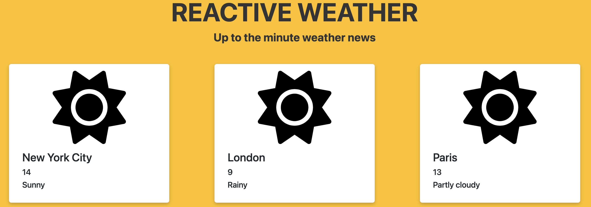
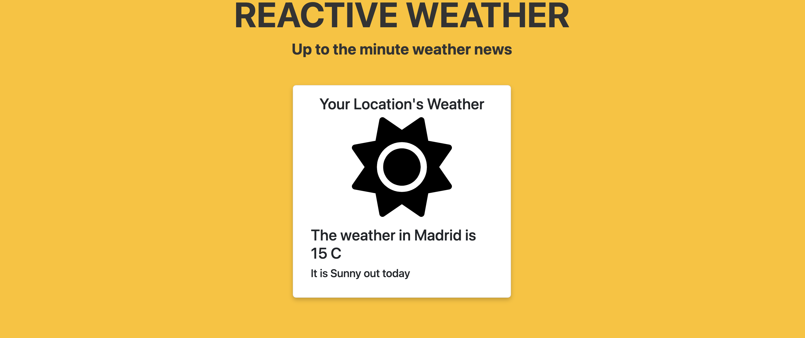
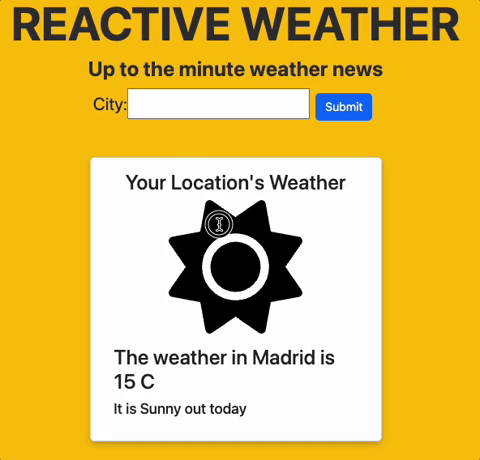

# Reactive Weather ☀️

A new startup, Reactive weather, has hired you to build a web application that renders real time weather data for cities around the world. This project will require that you utilize:
- Components
- Props
- State
- Conditional Rendering
- Controlled Inputs
- `fetch` and the `useEffect` Hook

## Part 1: React Components and Props

**GOAL**: An array of weather data has been provided for you in `data.js`. Render a `WeatherCard` in `App.js` for each city in the array and render the data for each city in the `WeatherCard`.



1. In the root directory, run the following to preview the app. This will refresh every time you save a file. 
    ```shell
    npm install
    npm start
    ```
2. In `WeatherCard.js`, a card has been made for you, but hasn't been exported. Export the card using `module.exports`.
3. In `App.js`, import:
    - The `cities` array from `data.js`.
    - The `WeatherCard` from `/components/WeatherCard.js`.
4. Inside the `<div className = "app">`, use a `map()` function to iterate through the cities array and return a `WeatherCard` component for each item in the array. Each `WeatherCard` component should receive the corresponding object with a key of data.
5. In `components/WeatherCard.js`, update the `function WeatherCard` with a `props` parameter.
6. Update the `WeatherCard` so that it renders the:
    - City name
    - Temperature
    - Forecasted weather conditions

## Part 2: React State and Conditional Rendering

**GOAL**: Complete the following using your knowledge of state and conditional rendering:
- Adjust the icons to render based on the value stored in forecast (e.g. if it is rainy the rainy icon will render).
- Create a myLocation component to track the users current location and stores the value in state. This component will update with the weather for the users specific location. We will dynamically update this in future sections!

**In `components/WeatherCard.js`**:
1. There are three additional weather icons available in the `assets` folder. Import these at the top of the file just like the `sunny` icon.
2. Conditionally render the icons based on the value stored in `props.data.forecast`. E.g. If it is "Rainy" than the rainy icon should render. There are multiple ways in which to achieve this output!


**In `App.js`**:
> We will be updating this state variable in Part 3. Today we are just working on setting up the functionality for hard coded state values.
1. At the top of the file, import `useState` from the React library.
2. Create a new state variable called `location` and state setter function. Initialize it with a value for the city of your choice.
3. In the `components` folder, create a `Location.js` file. Import this into `App.js`.
4. Pass the `data`, `location`, and state setter function as props to the `Location` component.

**In `components/Location.js`**:
1. We need to search the `data` array passed as a prop to find the object that has the city that matches our `location` state. Explore how to use [`.find()`](https://developer.mozilla.org/en-US/docs/Web/JavaScript/Reference/Global_Objects/Array/find) to achieve this.
2. Once you have found the corresponding data, return a card similar to the one in `WeatherCard.js`. It can look similar to the card below.
    - **NOTE**: It may help to turn the icon conditional rendering you wrote into a helper function and import it into this component so that you can use DRY principles.



## Part 3: Controlled Inputs

**GOAL**: Create a `Form` component that allows users to input their city and the program will output either:
1. The weather for the city they input
2. Some message informing the user that city is not in the array.

 

**In `App.js`**:
1. In the `components` folder, create a `Form.js` file. Import this into `App.js`.
2. Render the `Form` component near the top of your application. Pass it the `location` state and `setLocation` state setter function as props.

**In `components/Form.js`**:
1. Destructure the `location` and `setLocation` props.
2. Return a `<form>` element that has an `<input>` element that will accept a city input and `<button>` element. Feel free to create your own or you can use the template code below:

    ```jsx
    <div className = "form">
        <form>
            <label className = "city">City:
                <input type="text"/>
            </label>
            <button 
                className = "btn btn-primary" 
                type="submit"
            >Submit</button>
        </form>
    </div>
    ```

3. Assign the `<input>` a value of `location` and create an `onChange` event handler that sets the `location` to the current value of the `<input>` using `e.target.value`.

> Try out your form. Oh no! There's an error. Why? Currently the location state is updating every time you type and this is causing the application to error out.

4. Import `useState` from the React library.
5. Create a new piece of state called `typedLocation` and a state setter function. Initialize it as an empty string.
6. Update the `<input>` value as `typedLocation`. Update the `onChange` event handler to set `typedLocation` to the current value of `<input>` using `e.target.value`.
7. Create a `handleSubmit` function that does the following:
    - Accept the event as a parameter
    - Prevent the default form behavior using `e.preventDefault()`.
    - Call `setLocation` and pass it the current value of `typedLocation`.
    - Reset `typedLocation` to an empty string using the state setter function.
8. In the `<form>` opening tag, create an `onSubmit` event handler and pass it the `handleSubmit` function. 
9. Try out the form! It should work for any city in the array and should throw an error if you type a city that doesn't match.

**In components/Location.js**:

The user may submit a location that isn't in the array, we want to make sure that the program can handle this.
1. If the location is not found in the `data` array, render a message to the user like `"Location not found"` or something similar.
2. Try submitting an incorrect location to verify that your application can handle this input.

## Part 4: `useEffect` and `fetch`
In this part, you will add the ability to display a five-day forecast for the selected location using the useEffect hook.

Use a third-party API to fetch the five-day forecast for the selected location.
Add a state variable to the Weather component to store the fetched forecast data.
Use the useEffect hook to fetch the data when the component mounts.
Display the five-day forecast using a new component (e.g. ForecastItem).
That's it! By completing this project, your adult learners will have practiced creating React components and props, using React state, creating controlled inputs, and using the useEffect hook to fetch data from an external API. They will also have built a useful weather app!