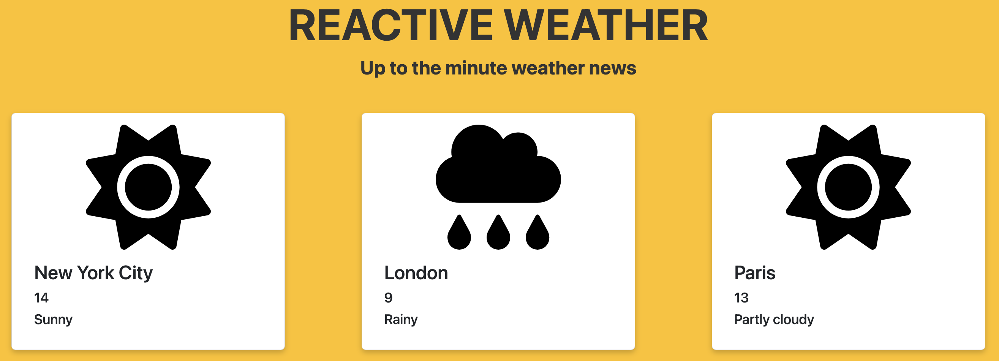

# Reactive Weather ☀️

A new startup, Reactive weather, has hired you to build a web application that renders real time weather data for cities around the world. This project will require that you utilize:
- Components
- Props
- State
- Conditional Rendering
- Controlled Inputs
- `fetch` and the `useEffect` Hook

## Part 1: React Components and Props

**GOAL**: An array of weather data has been provided for you in `data.js`. Render a `WeatherCard` in `App.js` for each city in the array and render the data for each city in the `WeatherCard`.


1. In the root directory, run the following to preview the app. This will refresh every time you save a file. 
    ```shell
    npm install
    npm start
    ```
2. In `WeatherCard.js`, a card has been made for you, but hasn't been exported. Export the card using `module.exports`.
3. In `App.js`, import:
    - The `cities` array from `data.js`.
    - The `WeatherCard` from `/components/WeatherCard.js`.
4. Inside the `<div className = "app">`, use a `map()` function to iterate through the cities array and return a `WeatherCard` component for each item in the array. Each `WeatherCard` component should receive the corresponding object with a key of data.
5. In `components/WeatherCard.js`, update the `function WeatherCard` with a `props` parameter.
6. Update the `WeatherCard` so that it renders the:
    - City name
    - Temperature
    - Forecasted weather conditions

## Part 2: React State and Conditional Rendering

**GOAL**: Complete the following using your knowledge of state and conditional rendering:
- Adjust the icons to render based on the value stored in forecast (e.g. if it is rainy the rainy icon will render).
- Create a myLocation component to track the users current location and stores the value in state. This component will update with the weather for the users specific location. We will dynamically update this in future sections!

**In `components/WeatherCard.js`**:
1. There are three additional weather icons available in the `assets` folder. Import these at the top of the file just like the `sunny` icon.
2. Conditionally render the icons based on the value stored in `props.data.forecast`. E.g. If it is "Rainy" than the rainy icon should render. There are multiple ways in which to achieve this output!



In the `components` folder, create a `myLocation.js` file. 

In this part, you will add the ability to switch between multiple locations by using React state.

Add a state variable to the Weather component to track the current location.

Add a dropdown menu to the Weather component that allows the user to select a different location.

Update the Weather component to fetch the current weather for the selected location when it changes.

## Part 3: Controlled Inputs
In this part, you will add the ability to search for a location using a controlled input.

Add a search bar to the Weather component that allows the user to search for a location.
Add a state variable to the Weather component to track the value of the search bar.
Update the Weather component to fetch the current weather for the searched location when the user submits the search.

## Part 4: `useEffect` and `fetch`
In this part, you will add the ability to display a five-day forecast for the selected location using the useEffect hook.

Use a third-party API to fetch the five-day forecast for the selected location.
Add a state variable to the Weather component to store the fetched forecast data.
Use the useEffect hook to fetch the data when the component mounts.
Display the five-day forecast using a new component (e.g. ForecastItem).
That's it! By completing this project, your adult learners will have practiced creating React components and props, using React state, creating controlled inputs, and using the useEffect hook to fetch data from an external API. They will also have built a useful weather app!